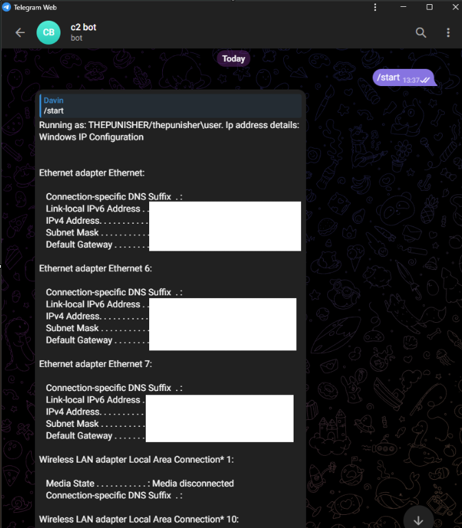
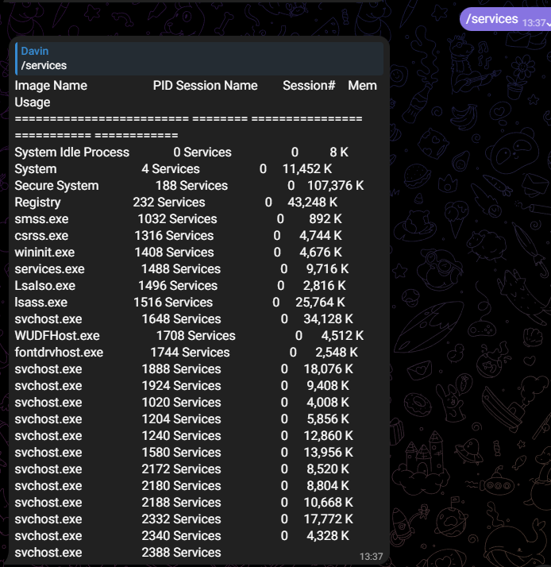
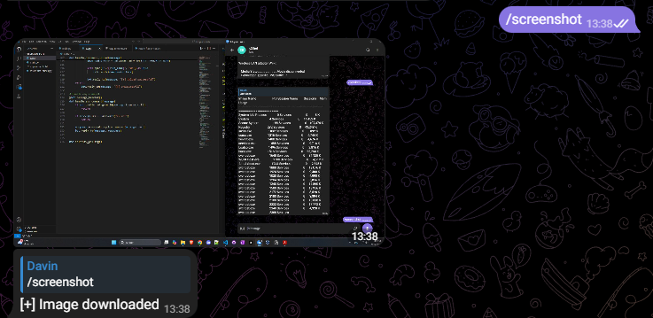
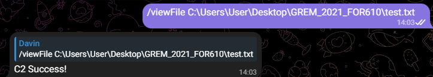

# Telegram C2 bot
 Remotely control a server via Telegram C2 bot

### Installation

- Create a telegram bot

- Create a .env file, set BOT_API_KEY to the bot's api key and telegram_user_id to your telegram chat id

- Install the following dependencies

```
pip install -r requirements.txt
```

### Running
- Run the code on target (Windows or Unix)
```
python3 ./c2.py
```
- On the telegram bot:
```
  /start                 - Start telegram bot
  /viewFile <path>       - Display the contents of a file
  /listDir <path>        - List the files in a directory
  /downloadFile <path>   - Download file from server to telegram
  /services              - List running services
  /screenshot            - Take screenshot of desktop
  /webcam                - Take image if webcam is supported
  /video <duration(sec)> - Record video from webcam
```
### Screenshots
/start for hostname, whoami and ipconfig info



/services for running processes



/screenshot



/viewFile InsertFilePath

